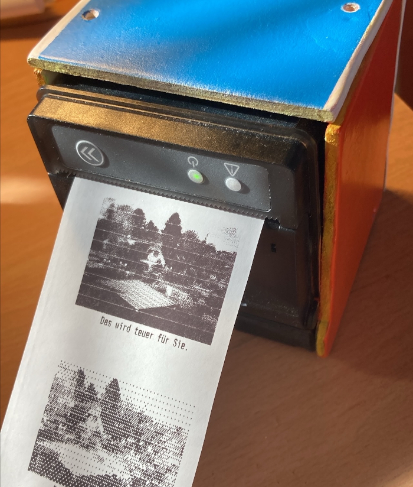
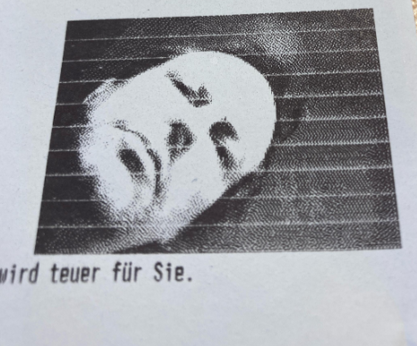
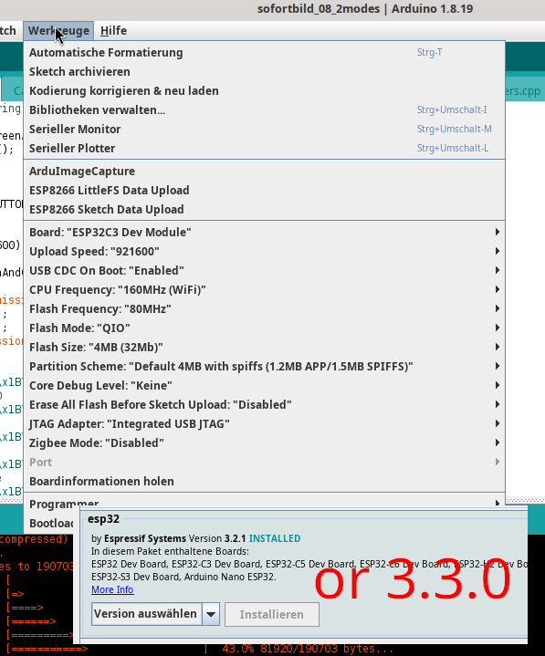

# color16cam

ESP32-c3, OV7670 and a ESC/POS receipt printer as instant camera.

**THIS IS THE ARDUINO-IDE Branch!** I am migrate the code to platform.IO on main.

## IMPORTANT

N E V E R   connect >5V to the ESP32-C3 SuperMini Board!

## wiring

ONLY the Printer needs 7.5 V! Cam and ESP32-C3 runns on 3.3V!

- GND, TX, RX to TTL UART of the printer
- 2 Lipo cells to get >= 7.5V for the printer
- D4..D7 -> GPIO 0..3
- RST -> 3.3V
- PWDN -> GND
- VSYNC -> GPIO 4
- PCLK -> GPIO 5
- XCLK -> GPIO 6
- SIOD -> GPIO 8
- SIOC -> GPIO 9
- picture button: GND + GPIO 7
- picture button2: GND + GPIO 10 (UNUSED)
- Use an AMS1117 3.3V voltage regulator to power the ESP32-C3 SuperMini
  Board via the 3.3V pin!!! Do not connect 7.5V to the 5V Pin!

## Hacks

- picture is 160x120px but blown up to 320x240 for more dithing space
- only the upper 4 bit of YUV grayscale are used (16 colors)
- ugly, but working: A big part of code runns with interupts off!
