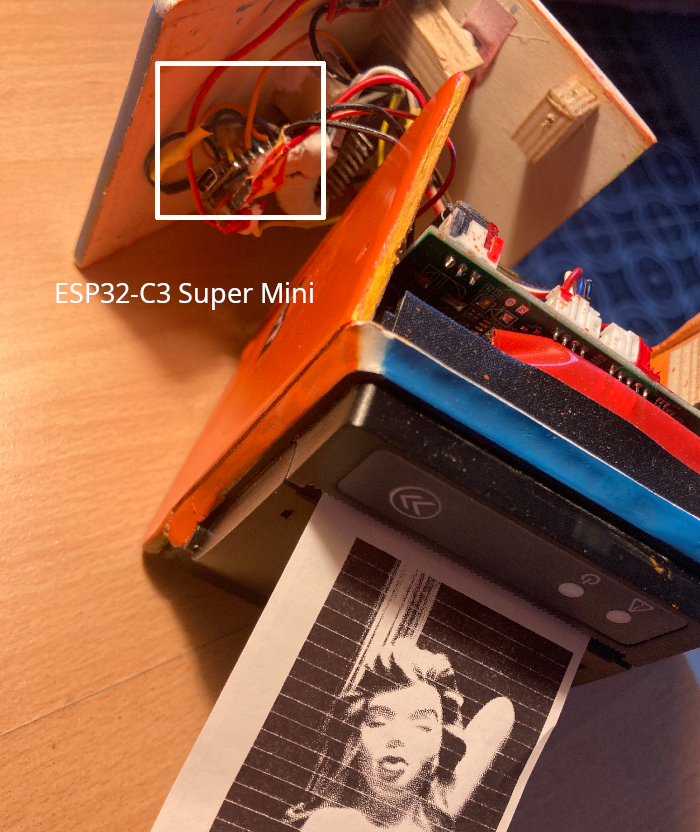

# This Branch

- ESP32-S3-DevKitM1 without PSRAM
- VSPI used for SSD1331 Display
- OV3660 Cam

## Features

- atkinson dithering
- 24bit high res ESC/POS Printing (58mm) via TTL UART
- 240x240 is skaled to 360x360 for more raster points
- internal WS2812 used for white flash and print process hint
- oled image with pins on top is fine
- printing is not mirrored or rotated
- OV3360 Cam with ribbon cable to bottom
- long press picture button: a zoomed dither preview on the display
- using a TIP110 + 120 Ohm resistor to Pin 01, DC Step Up to 12V a 12V
  LEDS wire used as flash-light